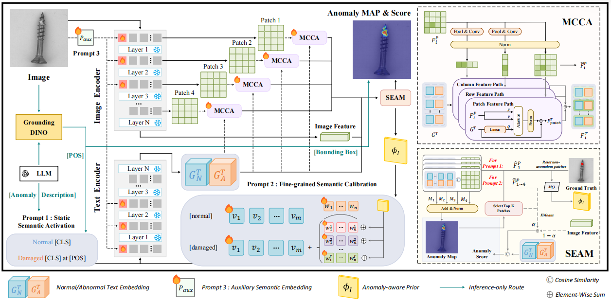
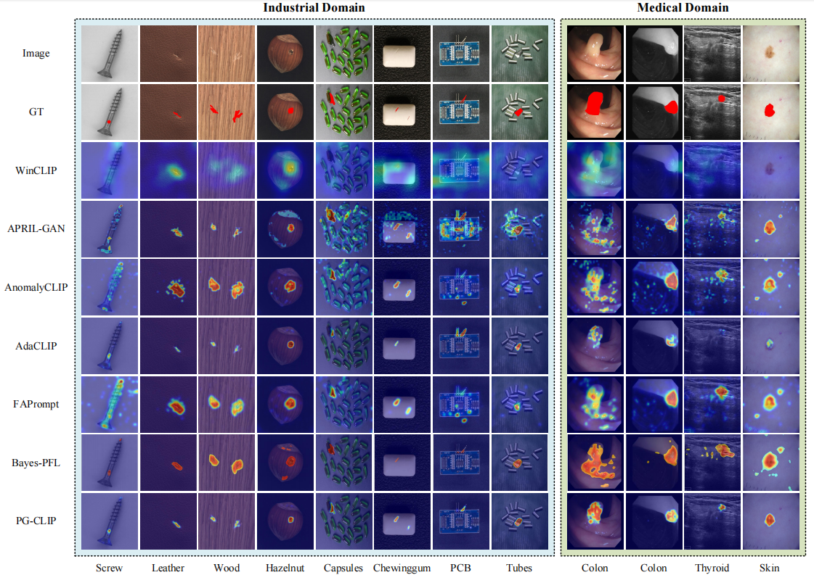
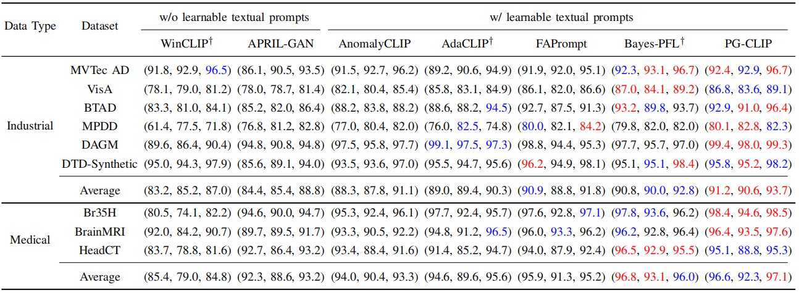
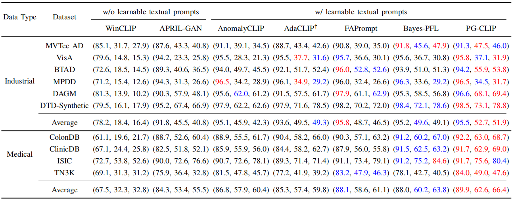

# PG-CLIP
Code for papaer *PG-CLIP: Zero-Shot Anomaly Detection via Progressively-Guided CLIP with Fine-grained Prompts*

**The proposed framework**

**The visulization of the results**

**Comparison of image-level metrics (AUROC, F1-Max, AP) across different ZSAD methods**

**Comparison of pixel-level metrics (AUROC, F1-Max, AP) across different ZSAD methods**

